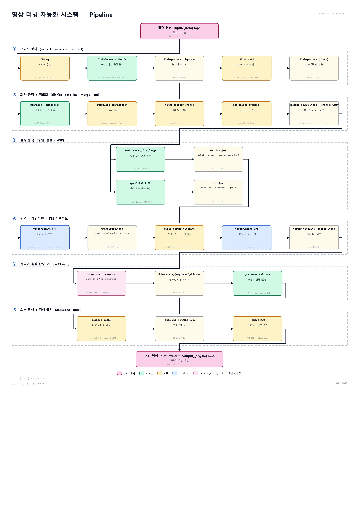

# 다국어 자동 더빙 시스템

> **영어 영상을 한국어로 자동 더빙하는 AI 파이프라인**
>
> 4 Stage · 10 Model · Docker 멀티 venv · 3 Daemon



---

## 📌 작품 개요

영어 영상을 입력받아 한국어 더빙 영상을 자동 생성한다. **BS-Roformer**로 vocal과 BGM을 분리하고 **Silero VAD**로 묵음을 제거한 뒤, **Qwen3-ASR**로 받아쓰기, **DiariZen + ECAPA-TDNN**으로 화자를 분리한다. **LightASD**와 **emotion2vec+**로 영상 속 화자·감정을 인식하고 **GPT 5.4**가 발화 길이를 맞춘 영-한 번역을 수행한다. **CosyVoice3**의 zero-shot voice cloning이 5초 reference로 화자별 음색을 보존하며 한국어를 합성하고, ffmpeg loudnorm(EBU R128)으로 BGM과 재믹스한다. **UTMOS-style MOS**가 품질을 자동 점수화하며, Docker 멀티 venv·daemon 구조로 의존성 격리와 메모리 상주를 함께 달성했다.

---

## 🎯 핵심 기능

- 🎙 **Zero-shot voice cloning** — 5초 reference로 화자 음색 보존, 영어→한국어 cross-lingual 합성
- 👥 **자동 화자 분리** — DiariZen + ECAPA-TDNN centroid 후처리 + AV-Fusion + ECAPA sliding window split
- 😊 **감정 인식·전이** — emotion2vec+ Large로 6개 카테고리 감지, reference voice + speed 조절
- 🎵 **BGM 보존** — BS-Roformer로 보컬만 교체, 배경음·효과음은 원본 유지
- 📊 **자동 품질 검증** — UTMOS-style MOS Evaluator로 합성 결과 자동 점수화
- 🐳 **인프라 최적화** — Docker 멀티 venv 4개로 의존성 격리, daemon 3개로 모델 로딩 60~90초 절감

---

## 🧠 사용 모델 (10개)

| # | 모델 | 스테이지 | 역할 |
|---|---|---|---|
| 1 | **BS-Roformer** | ① 분리 | vocal · BGM 분리 |
| 2 | **Silero VAD v5** | ① 분리 | 묵음 구간 제거 |
| 3 | **Qwen3-ASR-1.7B** | ② 분석 | 받아쓰기 + 단어 단위 timestamp |
| 4 | **DiariZen** | ② 분석 | 화자 분리 (turn 단위) |
| 5 | **ECAPA-TDNN** (SpeechBrain) | ② 분석 | 192-dim 화자 임베딩 + over-detect 자동 병합 |
| 6 | **LightASD** | ② 분석 | Active Speaker Detection (영상) |
| 7 | **emotion2vec+ Large** | ② 분석 | 감정 분류 (6 카테고리) |
| 8 | **MOS Evaluator** (UTMOS-style) | ③ Reference | 음성 품질 평가 (wav2vec2-base) |
| 9 | **GPT 5.4** | ③ 번역 | 영-한 번역 + 발화 길이 가이드 |
| 10 | **CosyVoice3** (Fun-CosyVoice3-0.5B) | ④ 합성 | Zero-shot voice cloning |

---

## ⚙️ 시스템 사양

```
OS:        Windows 11 + Docker Desktop + WSL2
GPU:       sm_120 (Blackwell 아키텍처, 16GB VRAM)
RAM:       63GB (Docker 50g 할당)
Storage:   1.9TB (모델 캐시 ~60GB)
Container: 56GB Docker image
```

### 주요 의존성
- Python 3.13 · CUDA 13.0 · PyTorch 2.11+cu130
- ffmpeg · librosa · soundfile · pyannote 3.3
- bitsandbytes (8-bit AdamW) · PEFT 0.10

### 학습 데이터
- **MOS Evaluator**: BVCC 2,254 + RAVDESS 1,440 = 총 3,694 wav (wav2vec2-base fine-tuning, SRCC 0.88)
- 모든 오디오는 **EBU R128 (-23 LUFS) · 24kHz** 표준으로 정규화

---

## 🚀 설치 및 실행

### 1) 환경 준비
```bash
# Repository clone
git clone https://github.com/yujin1103/AI_dubbing_system.git
cd AI_dubbing_system

# 환경변수 (LLM API key 등)
cp .env.example .env  # 본인 API key 입력 필요

# Docker 빌드 (시간 약 30~60분)
docker compose build

# Container 시작
docker compose up -d
```

### 2) 모델 가중치 다운로드
- CosyVoice3: ModelScope 자동 다운로드 (`/workspace/media/model_cache/modelscope/`)
- Qwen3-ASR-1.7B: HuggingFace 자동 다운로드
- DiariZen: 수동 다운로드 후 `/workspace/media/model_cache/diarizen/` 배치
- emotion2vec+, MOS Evaluator: 자동 다운로드

### 3) 더빙 실행

**기본 (강연·인터뷰 — 가장 적합)**
```bash
docker exec dubbing_pipeline /opt/venv_lipsync/bin/python /workspace/orchestrator.py \
  --input /workspace/media/input/video.mp4 \
  --lang ko \
  --smart-daemon
```

**빠른 검증 (~10분)**
```bash
docker exec dubbing_pipeline /opt/venv_lipsync/bin/python /workspace/orchestrator.py \
  --input /workspace/media/input/video.mp4 \
  --lang ko --content-type auto --smart-daemon
```

> 입모양 동기화·얼굴 화질 복원이 필요한 경우 [Optional 섹션](#-optional-입모양-동기화--후처리-단계) 참고.

---

## 📂 디렉토리 구조

```
AI_dubbing_system/
├── orchestrator.py             # 메인 파이프라인 (3,900+ lines)
├── asr_worker.py               # Qwen3-ASR subprocess
├── mos_evaluator.py            # MOS 품질 평가
├── train_mos.py                # MOS 모델 학습 (BVCC + RAVDESS)
│
├── dockerfile.base             # 베이스 이미지
├── dockerfile.orchestrator     # 통합 빌드
├── docker-compose.yml          # GPU + RAM 할당
│
├── scripts/                    # 보조 실행 스크립트
│   ├── segment_refiner.py      # ASD-guided + ECAPA sliding split
│   ├── av_fusion.py            # AV-Fusion 알고리즘
│   ├── asd_runner.py           # LightASD 실행
│   └── ...
│
├── patches/                    # 빌드 시 자동 적용 (dockerfile COPY)
│   ├── cosyvoice_daemon.py     # CosyVoice3 daemon (port 8901)
│   ├── asr_daemon.py           # Qwen3-ASR daemon (port 8902)
│   ├── diarize_daemon.py       # DiariZen daemon (port 8903)
│   └── ... (lipsync 관련은 Optional 섹션 참고)
│
├── configs/                    # 학습 yaml
├── docs/                       # 추가 문서
│
├── PIPELINE_OVERVIEW.md        # 시스템 가이드 문서
├── pipeline_diagram.png        # 메인 다이어그램 (6 stage)
│
└── media/                      # .gitignore 처리 (대용량)
    ├── input/                  # 입력 영상
    ├── output/                 # 더빙 결과
    ├── runs/                   # 작업 공간
    └── model_cache/            # HF/ModelScope 캐시 (~60GB)
```

---

## 📊 성능 (64초 영상 기준)

| 단계 | 시간 | 비율 |
|---|---|---|
| ① 오디오 분리 (BS-Roformer + Silero VAD) | 1:30 | 16% |
| ② 화자·감정 분석 (Qwen3-ASR + DiariZen + AV-Fusion + emotion2vec+) | 4:00 | 42% |
| ③ Reference + 번역 (MOS + GPT 5.4) | 1:30 | 16% |
| ④ 합성 + 믹스 (CosyVoice3 + ffmpeg) | 2:30 | 26% |
| **Total** | **~9~10분** | 100% |

> 100초 영상 (drama, multi-speaker): 15~25분.

---

## ⚠️ 알려진 한계

| 항목 | 영향 | 회피 방법 |
|---|---|---|
| **드라마 reverb 잔존** | ECAPA 화자 오인 + voice cloning robotic | dereverb 단계 추가 (DeepFilterNet CPU) |
| **DiariZen <1초 turn 누락** | 빠른 화자 교차 누락 | ECAPA sliding window split (구현됨) |
| **등돌이/off-screen 화자** | LightASD 무력 | ECAPA + temporal pattern 보조 |
| **GPT API 비용** | 긴 영상 시 토큰 누적 | batch=7 + budget rewrite ×2로 평균 30% 절감 |

---

## 🌐 기대효과

성우와 스튜디오 없이도 영상을 다국어로 즉시 변환한다. TED·교육·인터뷰처럼 clean recording 환경에서 자연스러운 더빙 품질을 보이며, 영어→한국어를 시작으로 일본어·스페인어 등 다국어로 확장 가능하다. Zero-shot voice cloning이 5초 reference로 화자 음색을 보존해 원본 정서까지 전달하고, AV-Fusion·ECAPA centroid 후처리로 다중 화자도 정확히 분리한다. UTMOS-style MOS Evaluator가 합성 결과를 자동 점수화로 품질 일관성을 보장하며, Docker 멀티 venv·daemon 구조로 의존성 격리와 재실행 속도를 확보했다. dereverb·실시간 처리를 추가하면 드라마·영화로 확장 가능하고, 글로벌 콘텐츠 접근성과 언어 장벽 해소에 기여한다.

---

## 🎬 Optional: 입모양 동기화 + 후처리 단계

기본 더빙 파이프라인 (① 분리 ~ ④ 합성)으로도 한국어 더빙 mp4가 완성된다. 시각적 이질감을 더 줄이고 싶을 때 **입모양 동기화 + 얼굴 화질 복원** 단계를 추가로 활성화할 수 있다.

### 🧠 추가 모델 (2개)

| # | 모델 | 역할 |
|---|---|---|
| 11 | **LatentSync 1.6 + Korean LoRA** | 입모양 동기화 (VAE diffusion) |
| 12 | **GFPGAN v1.4** | 얼굴 화질 복원 + 2x upscale |

- **LatentSync Korean LoRA**: AIHub 538 (립리딩 데이터셋) — 588영상 50k step (20시간) 학습

### 🚀 sm_120 LatentSync 가속 (3.18× 단축)

sm_120 GPU에서 LatentSync 1.6 inference 시간을 baseline 대비 **3.18× 단축**한 결과:

| 단계 | 설정 | 시간 | A 대비 |
|---|---|---|---|
| **A (baseline)** | DDIM 20 step | 29:30 | – |
| E | DPMSolver++ 10 step | 22:06 | −25% |
| H | + TensorRT FP16 (UNet engine) | 13:54 | −53% |
| **🏆 I (최종)** | **+ TeaCache (rel_l1=0.1)** | **9:15** | **−69%** |

**핵심 기법** (모두 sm_120 호환, 품질 손실 거의 없음):
1. **DPMSolver++ MultistepScheduler** — 디노이징 step 20→10 (UNet 호출 절반)
2. **TensorRT FP16 엔진** — UNet3D를 static-shape (B=2, T=16, 64×64) 엔진으로 컴파일
3. **TeaCache** — timestep 간 입력 변화량 누적 → threshold 미만 step 재사용 (~50% UNet skip)

> ⚠️ **SageAttention 3 (FP4 Blackwell)는 효과 없음**: 작은 batch(B=2) + 짧은 sequence 때문에 sweet spot 밖이라 baseline보다 오히려 느림 (검증 후 폐기)

자세한 적용 절차와 패치 파일 설명은 [docs/OPTIMIZATION_NOTES.md](./docs/OPTIMIZATION_NOTES.md) 참고.

### 활성화 방법

```bash
# 환경변수 (가속 옵션)
export LATENTSYNC_USE_TRT=1
export LATENTSYNC_TRT_ENGINE=/workspace/trt_work/engines/unet_fp16.trt
export LATENTSYNC_SCHEDULER=dpm
export LATENTSYNC_TEACACHE=0.1

# orchestrator 플래그
docker exec dubbing_pipeline /opt/venv_lipsync/bin/python /workspace/orchestrator.py \
  --input /workspace/media/input/video.mp4 \
  --lang ko \
  --enable-lipsync --use-lora \
  --enable-postprocess --postprocess-upscale 2 \
  --smart-daemon
```

### 비활성화 (기본값)

`--enable-lipsync` 플래그 없이 실행 → ④ CosyVoice TTS 단계에서 종료, 한국어 음성으로 BGM 재믹스한 mp4만 생성. 환경변수도 모두 무시.

### 추가 의존성

| 항목 | 비고 |
|---|---|
| **LatentSync 1.6** 가중치 | HuggingFace 자동 다운로드 (4.8 GB) |
| **Korean LoRA** | `media/lora/latentsync_ko.pt` 별도 학습 또는 제공 |
| **TensorRT FP16 엔진** | `unet_fp16.trt` (2.55 GB) — 별도 빌드 필요 |
| **GFPGAN v1.4** | `/opt/gfpgan_models/GFPGANv1.4.pth` (333 MB) |
| TensorRT 10.x | sm_120 호환, FP16 엔진 빌드용 |

### 단계 비활성화 시 효과

| 단계 | 활성화 (full) | 비활성화 (default) |
|---|---|---|
| 결과 mp4 | 한국어 음성 + 입모양 동기화 + 얼굴 화질 복원 | 한국어 음성만 (영상 그대로) |
| 64초 영상 처리 시간 | ~33분 (LatentSync 9분 + GFPGAN 22분) | ~10분 (TTS·믹싱까지만) |
| 추가 디스크 | ~8 GB (가중치·엔진) | 0 |

> 기본 사용 사례 (TED·강연·인터뷰 자막 대체)는 비활성화로 충분. 드라마·영화처럼 시각적 이질감을 최소화해야 할 때만 활성화 권장.

### Optional 단계의 알려진 한계

| 항목 | 영향 | 회피 방법 |
|---|---|---|
| **GFPGAN 후처리 22분 (1080p 64초)** | 전체 시간 비중 큼 | TRT FP16 변환 진행 중 (목표 ~7분) |
| **LoRA cheek pink artifact** | 광대뼈 색감 시프트 | nf=4 재학습 또는 cloud A100 학습 |
| **TRT 엔진 static shape** | num_frames=16, resolution=512 고정 | 다른 해상도 사용 시 엔진 재빌드 필요 |

---

## 📚 추가 문서

- [PIPELINE_OVERVIEW.md](./PIPELINE_OVERVIEW.md) — 모델·스테이지별 상세 설명
- [docs/OPTIMIZATION_NOTES.md](./docs/OPTIMIZATION_NOTES.md) — Optional 단계 가속 적용 노트 (3.18× 단축 재현)

---

## 📝 라이선스

MIT License (사용 모델별 라이선스는 각 모델 저장소 참고)

## 👥 Contributors

- [@yujin1103](https://github.com/yujin1103)
