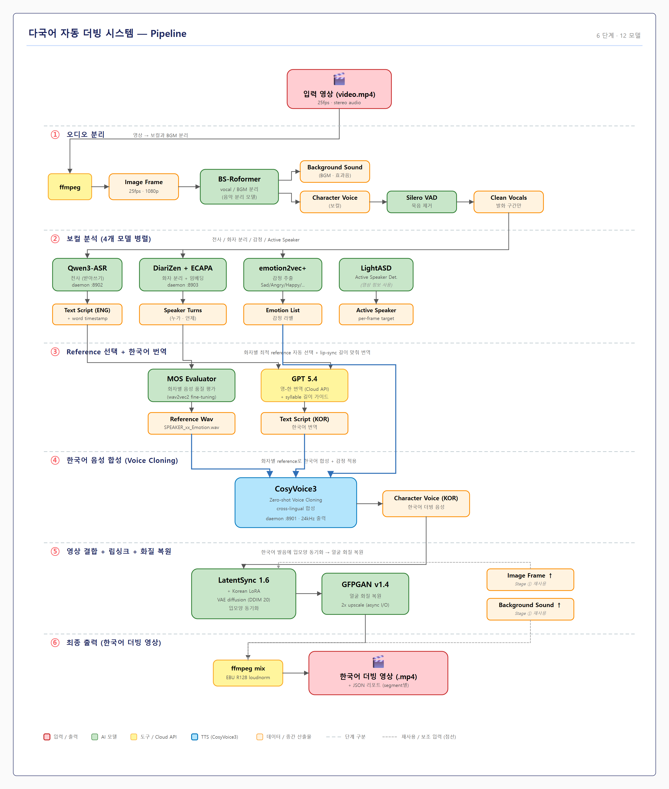

# 다국어 자동 더빙 시스템

> **영어 영상을 한국어로 자동 더빙하고 입모양까지 동기화하는 AI 파이프라인**
>
> 5 Stage · 12 Model · Docker 멀티 venv · 3 Daemon



---

## 📌 작품 개요

영어 영상을 입력받아 한국어 더빙 영상을 자동 생성한다. **ffmpeg**과 **BS-Roformer**로 vocal과 BGM을 분리하고, **Silero VAD**로 silence를 제거한 뒤, **Qwen3-ASR**로 받아쓰기, **DiariZen + ECAPA-TDNN**으로 화자를 분리한다. **LightASD**와 **emotion2vec+**로 영상 속 화자·감정을 인식하고 **GPT 5.4**가 lip-sync syllable 가이드에 맞춰 한국어로 번역한다. **CosyVoice3**의 zero-shot voice cloning으로 화자별 한국어를 합성한 뒤 **LatentSync 1.6 + Korean LoRA**로 입모양을 맞추고 **GFPGAN**으로 화질을 복원한다. Docker 멀티 venv 4개 + daemon 3개 구조로 의존성 격리와 메모리 상주를 동시에 달성했다.

---

## 🎯 핵심 기능

- 🎙 **Zero-shot voice cloning** — 5초 reference로 화자 음색 보존, 영어→한국어 cross-lingual 합성
- 🎬 **한국어 입모양 동기화** — AIHub 588영상 50k step 학습한 Korean LoRA (SyncNet 1.86)
- 👥 **자동 화자 분리** — DiariZen + ECAPA-TDNN centroid 후처리 + AV-Fusion + ECAPA sliding window split
- 😊 **감정 인식·전이** — emotion2vec+ Large로 6개 카테고리 감지, reference voice + speed 조절
- 🎵 **BGM 보존** — BS-Roformer로 보컬만 교체, 배경음·효과음은 원본 유지
- 🐳 **인프라 최적화** — Docker 멀티 venv 4개로 의존성 격리, daemon 3개로 모델 로딩 60~90초 절감

---

## 🧠 사용 모델 (12개)

| # | 모델 | 스테이지 | 역할 |
|---|---|---|---|
| 1 | **BS-Roformer** | ① 분리 | vocal · BGM 분리 |
| 2 | **Silero VAD v5** | ① 분리 | 묵음 구간 제거 |
| 3 | **Qwen3-ASR-1.7B** | ② 분석 | 받아쓰기 + 단어 단위 timestamp |
| 4 | **DiariZen** | ② 분석 | 화자 분리 (turn 단위) |
| 5 | **ECAPA-TDNN** (SpeechBrain) | ② 분석 | 192-dim 화자 임베딩 + over-detect 자동 병합 |
| 6 | **LightASD** | ② 분석 | Active Speaker Detection (영상) |
| 7 | **emotion2vec+ Large** | ② 분석 | 감정 분류 (6 카테고리) |
| 8 | **MOS Evaluator** (UTMOS-style) | ③ Reference | 음성 품질 평가 (wav2vec2-base) |
| 9 | **GPT 5.4** | ③ 번역 | 영-한 번역 + syllable 가이드 |
| 10 | **CosyVoice3** (Fun-CosyVoice3-0.5B) | ④ 합성 | Zero-shot voice cloning |
| 11 | **LatentSync 1.6 + Korean LoRA** | ⑤ 립싱크 | 입모양 동기화 (VAE diffusion) |
| 12 | **GFPGAN v1.4** | ⑤ 화질 | 얼굴 복원 + 2x upscale |

---

## ⚙️ 시스템 사양

```
OS:        Windows 11 + Docker Desktop + WSL2
GPU:       sm_120 (Blackwell 아키텍처, 16GB VRAM)
RAM:       63GB (Docker 50g 할당)
Storage:   1.9TB (모델 캐시 ~60GB, AIHub 데이터 ~510GB)
Container: 56GB Docker image
```

### 주요 의존성
- Python 3.13 · CUDA 13.0 · PyTorch 2.11+cu130
- TensorRT 10.x (sm_120 호환, FP16 엔진)
- PEFT 0.10 (LoRA r=32) · 8-bit AdamW (bitsandbytes)
- ffmpeg · librosa · soundfile · pyannote 3.3

### 학습 데이터
- **LatentSync Korean LoRA**: AIHub 538 (립리딩 데이터셋) — 588영상, 50k step (20시간)
- **MOS Evaluator**: BVCC 2,254 + RAVDESS 1,440 = 총 3,694 wav (wav2vec2-base fine-tuning, SRCC 0.88)

---

## 🚀 설치 및 실행

### 1) 환경 준비
```bash
# Repository clone
git clone https://github.com/yujin1103/AI_dubbing_system.git
cd AI_dubbing_system

# Docker 빌드 (시간 약 30~60분)
docker compose build

# Container 시작
docker compose up -d
```

### 2) 모델 가중치 다운로드
- CosyVoice3: ModelScope 자동 다운로드 (`/workspace/media/model_cache/modelscope/`)
- Qwen3-ASR-1.7B: HuggingFace 자동 다운로드
- DiariZen: 수동 다운로드 후 `/workspace/media/model_cache/diarizen/` 배치
- LatentSync 1.6: 자동 다운로드
- 한국어 LoRA: `media/lora/latentsync_ko.pt` (별도 학습 필요 또는 제공)

### 3) 더빙 실행

**기본 (강연·인터뷰 — 가장 적합)**
```bash
docker exec dubbing_pipeline /opt/venv_lipsync/bin/python /workspace/orchestrator.py \
  --input /workspace/media/input/video.mp4 \
  --lang ko \
  --enable-lipsync \
  --enable-postprocess --postprocess-upscale 2 \
  --smart-daemon
```

**한국어 LoRA 사용 (품질 ↑)**
```bash
docker exec dubbing_pipeline /opt/venv_lipsync/bin/python /workspace/orchestrator.py \
  --input /workspace/media/input/video.mp4 \
  --lang ko \
  --enable-lipsync --use-lora \
  --lipsync-config stage2_512_nf16_smallmask.yaml \
  --enable-postprocess --postprocess-upscale 2 \
  --smart-daemon
```

**빠른 검증 (dubbing only, ~10분)**
```bash
docker exec dubbing_pipeline /opt/venv_lipsync/bin/python /workspace/orchestrator.py \
  --input /workspace/media/input/video.mp4 \
  --lang ko --content-type auto --smart-daemon
```

---

## 📂 디렉토리 구조

```
AI_dubbing_system/
├── orchestrator.py             # 메인 파이프라인 (3,900+ lines)
├── asr_worker.py               # Qwen3-ASR subprocess
├── mos_evaluator.py            # MOS 품질 평가
├── train_mos.py                # MOS 모델 학습 (BVCC + RAVDESS)
│
├── dockerfile.base             # 베이스 이미지
├── dockerfile.orchestrator     # 통합 빌드 (LatentSync + LoRA + 패치)
├── docker-compose.yml          # GPU + RAM 할당
│
├── scripts/                    # 보조 실행 스크립트
│   ├── segment_refiner.py      # ASD-guided + ECAPA sliding split
│   ├── av_fusion.py            # AV-Fusion 알고리즘
│   ├── asd_runner.py           # LightASD 실행
│   └── ...
│
├── patches/                    # 빌드 시 자동 적용 (dockerfile COPY)
│   ├── cosyvoice_daemon.py     # CosyVoice3 daemon (port 8901)
│   ├── asr_daemon.py           # Qwen3-ASR daemon (port 8902)
│   ├── diarize_daemon.py       # DiariZen daemon (port 8903)
│   ├── latentsync_inference_v27.py
│   ├── gfpgan_async_postprocess.py
│   └── ...
│
├── configs/                    # 학습 yaml
│   ├── lora_smoke.yaml         # LoRA 검증용 (10~30 step)
│   └── lora_full_train.yaml    # 50k step 전체 학습
│
├── PIPELINE_OVERVIEW.md        # 시스템 가이드 문서
├── PIPELINE_OVERVIEW.pptx      # 14 슬라이드 발표 자료
├── PIPELINE_PRESENTATION_SCRIPT.md   # 발표 대본
│
├── pipeline_v3.png             # 메인 다이어그램 (이 README용)
├── system_overview.png         # 환경·인프라 다이어그램
├── model_io_matrix.png         # 12개 모델 I/O 매트릭스
│
└── media/                      # .gitignore 처리 (대용량)
    ├── input/                  # 입력 영상 (.gitignore)
    ├── output/                 # 더빙 결과 (.gitignore)
    ├── runs/                   # 작업 공간 (.gitignore)
    ├── reports/                # JSON 리포트 (.gitignore)
    ├── lora/                   # 한국어 LoRA 가중치 (.gitignore, 4.10GB)
    └── model_cache/            # HF/ModelScope 캐시 (.gitignore, ~60GB)
```

---

## 📊 성능

### 단계별 소요 시간 (가속 적용 후, 64초 영상 기준)

| 단계 | 가속 전 | 가속 후 | 비고 |
|---|---|---|---|
| BS-Roformer + Silero VAD | 1:30 | 1:30 | – |
| Qwen3-ASR + DiariZen + AV-Fusion | 3:00 | 3:00 | – |
| Emotion + MOS | 1:00 | 1:00 | – |
| LLM 번역 (batch=7) | 0:30 | 0:30 | – |
| CosyVoice TTS | 2:00 | 2:00 | – |
| ffmpeg mix | 0:15 | 0:15 | – |
| **LatentSync 1.6** | **29:30** | **9:15** | 🚀 **−69%** (3.18× 배속) |
| GFPGAN async 2x | 22:00 | 22:00 | TRT 변환 진행 중 |

### 🚀 LatentSync 가속 (sm_120 Blackwell 호환)

sm_120 GPU에서 LatentSync 1.6 inference 시간을 **3.18× 단축**한 결과:

| 단계 | 설정 | 시간 | A 대비 |
|---|---|---|---|
| **A (baseline)** | DDIM 20 step | 29:30 | – |
| E | DPMSolver++ 10 step | 22:06 | −25% |
| H | + TensorRT FP16 (UNet engine) | 13:54 | −53% |
| **🏆 I (최종)** | **+ TeaCache (rel_l1=0.1)** | **9:15** | **−69%** |

**핵심 기법** (모두 sm_120 호환, 품질 손실 거의 없음):
1. **DPMSolver++ MultistepScheduler** — 디노이징 step 20→10 (UNet 호출 절반)
2. **TensorRT FP16 엔진** — UNet3D를 static-shape (B=2, T=16, 64×64) 엔진으로 컴파일
3. **TeaCache** — timestep 간 입력 변화량 누적 → threshold 미만 step 재사용 (~50% UNet skip)

> ⚠️ **SageAttention 3 (FP4 Blackwell)는 효과 없음**: 작은 batch(B=2) + 짧은 sequence 때문에 sweet spot 밖이라 baseline보다 오히려 느림 (검증 후 폐기)

### 환경변수 (가속 옵션 토글)

```bash
LATENTSYNC_USE_TRT=1                                    # TRT 엔진 활성
LATENTSYNC_TRT_ENGINE=/workspace/trt_work/engines/unet_fp16.trt
LATENTSYNC_SCHEDULER=dpm                                # DPMSolver++ 사용
LATENTSYNC_TEACACHE=0.1                                 # TeaCache rel_l1 threshold
```

---

## ⚠️ 알려진 한계

| 항목 | 영향 | 회피 방법 |
|---|---|---|
| **드라마 reverb 잔존** | ECAPA 화자 오인 + voice cloning robotic | dereverb 단계 추가 (DeepFilterNet CPU) |
| **DiariZen <1초 turn 누락** | 빠른 화자 교차 누락 | ECAPA sliding window split (구현됨) |
| **등돌이/off-screen 화자** | LightASD 무력 | ECAPA + temporal pattern 보조 |
| **GFPGAN 후처리 22분 (1080p 64초)** | 전체 시간 비중 큼 | TRT FP16 변환 진행 중 (목표 ~7분) |
| **LoRA cheek pink artifact** | 광대뼈 색감 시프트 | nf=4 재학습 또는 cloud A100 학습 |
| **TRT 엔진 static shape** | num_frames=16, resolution=512 고정 | 다른 해상도 사용 시 엔진 재빌드 필요 |

---

## 🌐 기대효과

성우와 스튜디오 없이도 영상을 다국어로 즉시 변환한다. TED·교육·인터뷰처럼 clean recording 환경에서 자연스러운 더빙 품질을 보이며, LoRA 가중치 파일만 추가하면 영어→한국어를 시작으로 일본어·스페인어 등 다국어로 확장된다. Zero-shot voice cloning이 화자 음색을 보존해 원본 정서까지 전달하고, AIHub 립리딩으로 학습한 한국어 LoRA가 입모양을 한국어 발음에 맞춰 재생성해 시각적 이질감을 줄였다. Docker 멀티 venv·daemon 구조로 의존성 격리와 재실행 속도를 함께 확보했다. 향후 dereverb·실시간 처리를 추가하면 드라마·영화로 확장 가능하며, 글로벌 콘텐츠 접근성과 비영어권 학습자의 언어 장벽 해소에 기여한다.

---

## 📚 추가 문서

- [PIPELINE_OVERVIEW.md](./PIPELINE_OVERVIEW.md) — 모델·스테이지별 상세 설명
- [PIPELINE_OVERVIEW.pptx](./PIPELINE_OVERVIEW.pptx) — 14 슬라이드 발표 자료
- [PIPELINE_PRESENTATION_SCRIPT.md](./PIPELINE_PRESENTATION_SCRIPT.md) — 발표 대본 (18~22분)
- [pipeline_v3.png](./pipeline_v3.png) — 메인 다이어그램
- [system_overview.png](./system_overview.png) — 환경·인프라 다이어그램
- [model_io_matrix.png](./model_io_matrix.png) — 12개 모델 I/O 매트릭스

---

## 📝 라이선스

MIT License (사용 모델별 라이선스는 각 모델 저장소 참고)

## 👥 Contributors

- [@yujin1103](https://github.com/yujin1103)
